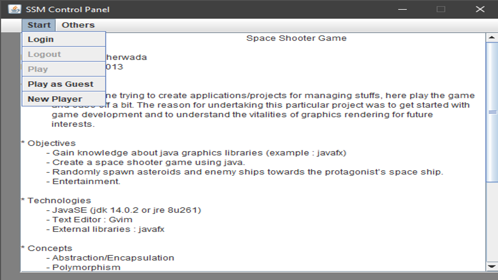
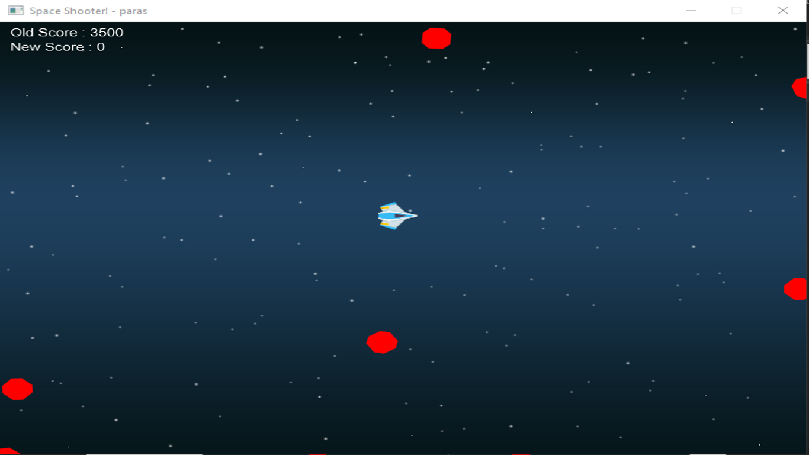

# About
“Space Shooter” is a classic game that has been popular around the world for more then 3 decades. It has been developed for various gaming platforms like PC, Xbox, Play Station, Sega, Nintendo and for cell phones as well. The game revolves around a space ship which has embarked on a mission to eliminate as many asteroids and alien spaceships as possible and gather points for each successful elimination.

Technologies used : Java SE, Java FX and Oracle 18c

* Events
    * Register new user
    * Login & Play
    * Play as guest
    * Logout
    * View Player(s) Stats
    * View Controls
    * View About
  
# Screenshots
  1. On Start Up
     
     Welcomed with a few details of the project (and myself), here we can see the purpose and objective to undertake the project.

     

  2. Menu Option - Start
     
     A drop down like menubar element with the supported options set within it.

     

  3. Menu Option - Others

     Similar to previous menubar element but having its own set of supported options.

     

  4. In game - (Playing as Guest)

     Here we see that the game has launched, we have our protagonist's space ship at the center of window and a number of asteroids that we are supposed to destroy.

     PS : As we are playing as guest, our progress will not be saved. To save progress we need to goto to the "Start" option in menubar and register ourselves by clicking on the "New Player" option (as visible in screenshot #2).

     

  5. On collision (with asteroid)

     What happens when you crash into an asteroid?
     
     

  6. In game - (Login & Play)

     After we have registered ourselves as explained in step #4, we can proceed to login (by going to "Start -> Login") and launching the game by clicking the "Play" menu item in "Start" menu.

     PS : When you login you cannot play as guest anymore or login until you logout. Hence the options "Play as Guest" and "Login" get disabled. Once logged out, those options will be enabled back again.

     As the game launches, we notice that our previous high score is visible on the top left of the game window (as opposed to when we played as guest, because no progress is saved when playing as guest).

     Over here, the number of asteroids destroyed, the points scored and the number of collisions occurred will all be stored for the logged in user.

     

  7. Statistics

     Shows the records of all players and their scores in decreasing order of their high scores.

     

# Learning Objective
* Inheritance
* Polymorphism
* Data Retrieval & DML(s)

# Helpful Links
* [Java FX](https://www.javatpoint.com/javafx-tutorial)
* [Key Event Listener Examples](https://www.programcreek.com/java-api-examples/?class=javafx.scene.Scene&method=setOnKeyPressed)